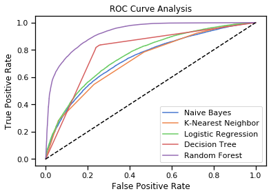

# Predicting Drug Review Ratings from Review Text

## Table of Contents
1. Data Wrangling 
      1.1 [Code](3_DataWrangling_Code) 
      1.2 [Report](3_DataWrangling_Report)
2. Data Storytelling 
      2.1 [Code](4_DataStorytelling_Code) 
      2.2 [Report](4_DataStorytelling_Report)
3. Statistical Analysis 
      3.1 [Code](5_StatisticalAnalysis_Code) 
      3.2 [Report](5_StatisticalAnalysis_Report)
4. Machine Learning  
      4.1 [Code](7_MachineLearning_Code) 
      4.2 [Report](7_MachineLearning_Report)
5. Final Report and Presentation 
      6.1 [Final Report](8_Final_Report) 
      6.2 [Presentation](8_Final_Presentation)

## Overview
Created a model with an AUC score of 0.93 that predicts whether a drug review will have a good rating solely from the review text.

Drug reviews provide important information to drug manufacturers, such as levels of customer satisfaction, successful outcomes, or negative side effects. Several websites exist with drug reviews that could potentially be scraped and used for analysis or product research. However, the rating scales and information required often differ from site to site. Being able to predict whether or not a rating would be good based on the review text allows us to label reviews with missing ratings, standardize ratings across review sources, and better understand the factors that most influence a drug’s rating.
